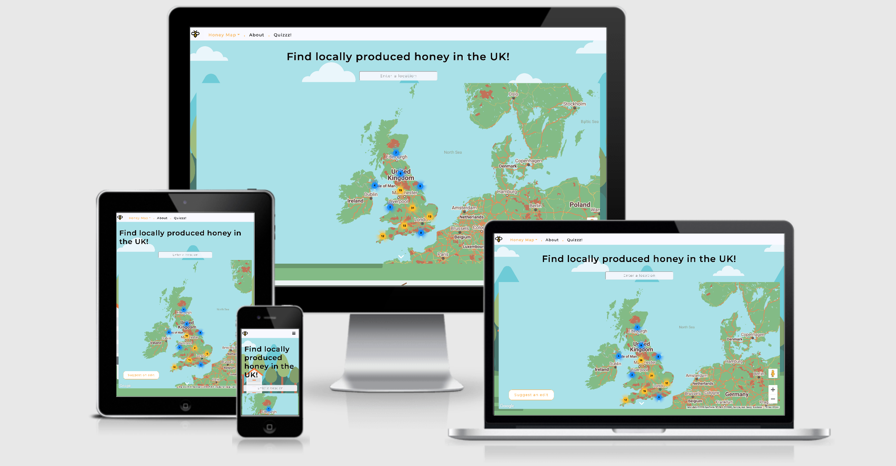

# Honey Locator UK 
## Milestone Project 2: Interactive Frontend Development - Code Institute

"Honey Locator UK” combines a googleMaps API along with various other interactive aspects to create a fun, educational and informative website. The website is responsive on a range of devices to increase accessibility. The layout of the site is clean and has conveniently placed navigation throughout.  

 
## User Experience (UX)

### User stories

#### First Time User Goals

 1. As a First Time User, I want to easily understand the purpose of the website and the services it offers 

 2. As a First Time User, I want to be able to navigate intuitively through the site

#### Returning User Goals

 1. As a Returning User, I want to discover local honey near me 

 2. As a Returning User, I want to find out how I am able to purchase the honey 

 3. As a Returning User, I want to understand the benefits of buying local honey 

 4. As a Returning User, I want to learn more about honey production 

 #### Frequent User Goals

 1. As a Frequent User, I want to be able to inform the website of any incorrect or missing shops 
    
 2. As a Frequent User, I want to be able to save my favourite locations 

### Design 

#### The design was based images and colours that one would associate with bees and honey. The background-image on the home page provided much of the inspiration for the colour scheme present thoughout the website.

#### Colour Scheme
 - Html colour matcher (link) was used to ascertain the main colours to be used though out The main colours used throughout the site; ____ . Creating a consistent theme throughout.

#### Typography
 - The ___ font is used on all pages with Sans Serif as the back-up font. Research was conducted to find fonts most used on educational sites…  Varying font weights and letter-spacing where used for aesthetic and distinguishing purposes.

#### Imagery
 - Each image was chosen based on its relations to bees / honey. Where possible, the 

#### Layout 
 - The layout of the site was designed to be as intuitive as possible for the user, with information being presented in a logical manner Honey Map, introduces the company. 

### Wireframes

[Wireframe for desktop]( "Desktop Wireframe")

[Wireframe for mobile]( "Mobile Wireframe")

## Features

### Existing Features

-   The site uses bootstrap grid and media queries in order to be responsive at a variety of sized
-   Hover-overs are used to indicate that an element is interactive
-   GoogleMaps API is used to create the honey locator map 
-	GooglePlaces API is used for place autocomplete search bar for the map 
-	Geolocation prompts the user via an alert when entering the home page 
-	Marker cluster cdn is used to create marker clusters to avoid over-crowding the map with marker 
-	“Suggest an edit” button triggers a modal form that when completed is sent via emailjs 
-	Local stoage stores lists 
-	Flip is used to create the flip effect of cards in about.html, revealing more information 
-	The multiple-choice quiz in quiz.html contains pagination a progress bar. The results page provides feedback to the user with the results and presents the options to show answers (using toggle jquery) or try again (using page reload)  
-	The navbar collapses on smaller screen sizes to conserve screen real estate
-	The addition of Smooth Scrolling gives the impression of seamlessness

### Features Left to Implement
-	GoogleDirections api to provide directions from place search to marker 
-	It would be helpful if “Your List” section contained an anchor to the website to allow the user easier access 

## Technologies Used

### Languages Used

- [HTML5](https://en.wikipedia.org/wiki/HTML5)
- [CSS3](https://en.wikipedia.org/wiki/Cascading_Style_Sheets)
- JavaScript

### Frameworks, Libraries & Programs Used

1. [Bootstrap 4.5:](https://getbootstrap.com/docs/4.5/getting-started/download/)
    - Bootstrap was used to help make the website responsive on a range of devices

2. [Figma:](https://www.figma.com/)
    - Figma was used to create the [wireframes](figma link) during the design process

3. [Font Awesome:](https://fontawesome.com/)
    -  Font Awesome icons were used for the details section and the social media links in the footer

4. [Git](https://git-scm.com/)
    - The Gitpod terminal from Git was used to commit to Git and Push to GitHub

5. [GitHub:](https://github.com/)
    - GitHub was used to store the code after being pushed from Git

6. [Google Fonts:](https://fonts.google.com/)
    - Google fonts was used to import the ‘Spartan’ font into the style.css
7. [GoogleMaps API:](https://fonts.google.com/)
8. [GooglePlaces API:](https://fonts.google.com/)
9. [MarkerClusterer CDN:](https://fonts.google.com/)
10. [Flip Jquery CDN:](https://fonts.google.com/)
11. [jequery]

## Testing

The W3C Markup Validator and W3C CSS Validator Services were used to validate the project:

-   [W3C Markup Validator](https://validator.w3.org/#validate_by_input)
-   [W3C CSS Validator](https://jigsaw.w3.org/css-validator/#validate_by_input)

### Testing User stories

#### First Time User Goals

   1. As a First Time User, I want to easily understand the purpose of the website and the services it offers 

    * The heading clearing states “Find locally produced honey near you” informing the user of what the website offers 
    * Bee and honey related Imagery throughout the site suggests the nature of the website to the user
    * Imagery indicators throughout show bees / honey 

   2. As a First Time User, I want to be able to navigate intuitively through the site

        *	Upon entering the site, the navigation bar is positioned at the top of the page and unobstructed by any images. This makes it easy for users to locate and read
        *	The navigation bar is stuck to the top of the screen so the user is always able to navigate wherever they are in the site
        *	In accordance with UX expectancies the logo, in the right-hand corner, navigates users back to the homepage
        *	All navigation links provide feedback to the user with hover overs, this makes them easily identifiable as links
        *	As the home page contains two sections, the honey map has dropdown navigation to allow the user to select which section of the page they wish to visit

#### Returning User Goals

   1. As a Returning User, I want to find out how I am able to purchase the honey 

    *	Clicking on each marker opens an info window for that specific place, the info window contains contact information; phone number and website 
    *	If the location has a website, clicking will direct the user to that website in a new tab
    *	The info window also contains a link to googleMaps that places the marker on the specific location in a separate tab to allow the user to take full advantage of googleMaps functions, such as directions 

    2. As a Returning User, I want to find out how I am able to purchase the honey 

        *	Clicking on each marker opens an info window for that specific place, the info window contains contact information; phone number and website 
        *	If the location has a website, clicking will direct the user to that website in a new tab
        *	The info window also contains a link to googleMaps that places the marker on the specific location in a separate tab to allow the user to take full advantage of googleMaps functions, such as directions 

    3. As a Returning User, I want to understand the benefits of buying local honey 

    4. As a Returning User, I want to learn more about honey production 
 
 #### Frequent User Goals

   1. As a Frequent User, I want to be able to inform the website of any incorrect or missing shops 

      *	There is a “Suggest an Edit” button on the map that opens a modal which allows the user to contact the maintainer of the site with any suggestions. The form is linked to JSemail and will notify on the maintainer on submit.

    2. As a Frequent User, I want to be able to save my favourite locations 

      * The “Add to list” button on the infoWindow allows the users to compile a personalised list of their favourite places and their information. Local storage means they are able to leave the site or the page and their list will remain until it is cleared. 

### Testing Interactive Elements 

#### All navigation links send users to the expected destination

#### GoogleMaps:
 - Performs as expected 
 -	If the user enters an unknown address in to the searchBar an error alert appears “__”

#### Suggest an Edit Modal:
 - An error message appears an invalid email address 
 -	when all inputs are valid the submit button refreshes the page 
 -	An email is sent to the linked JS gmail account 

#### Your List:
 -	Performs as expected 
 -	If the user attempts to add the same information twice an error alert appears “_”

#### Flip cards in “About” page:
 -	Performs as expected 
 -	The card flips and reveals new information on click 

#### 
 -	Performs as expected 
 -	If the user clicks next without choosing an option an error alert appears “_”

### Further Testing
 
 - The Website was tested on Google Chrome, Firefox, Microsoft Edge and Safari browsers.
 - The website was tested on a variety of devices such as Desktop, Laptop, iPad mini,  iPhone 7, iPhone 8, iPhoneX and Nokia E30
 - Friends and family members viewed the site and provided feedback on bugs and UX issues

