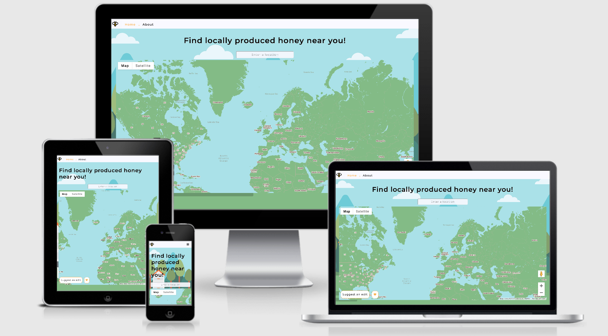

# Honey Locator UK 
## Milestone Project 2: Interactive Frontend Development - Code Institute

“Honey Locator UK” combines a Google Maps Javascript API along with various other interactive aspects to create a fun, educational and informative website. The website is responsive on a range of devices to increase accessibility. The layout of the site is clean and has conveniently placed navigation throughout. 

[The live website can be found here](https://irahbt.github.io/honey-locator)
 
## User Experience (UX)

### User stories

#### First Time User Goals

 1. As a First Time User, I want to easily understand the purpose of the website and the services it offers 

 2. As a First Time User, I want to be able to navigate intuitively through the site

#### Returning User Goals

 1. As a Returning User, I want to discover local honey near me 

 2. As a Returning User, I want to find out how I am able to purchase the honey 

 3. As a Returning User, I want to understand the benefits of buying local honey 

#### Frequent User Goals

 1. As a Frequent User, I want to be able to inform the website of any incorrect or missing shops 
    
 2. As a Frequent User, I want to be able to save my favourite locations 

### Design 

#### The design was based on images and colours that one would associate with bees and honey. 

#### Colour Scheme
 - The background-image on the home page provided much of the inspiration for the colour scheme present though-out the website. [Html colour matcher](https://html-color-codes.info/colors-from-image/) was used to ascertain the main colours to be used creating a consistent theme.

#### Typography
 - The Montserrat font is used on all pages with Sans Serif as the back-up font. The font was chosen based on the most commonly used fonts for[educational websites](https://www.ilovewp.com/resources/education/wordpress-for-schools/most-used-google-fonts-on-school-websites/).  Varying font weights and letter-spacing where used for aesthetic and distinguishing purposes.

#### Imagery
 - Each image was chosen based on its relations to bees / honey. Where possible, images from the same artist were used for style consistency. 

#### Layout 
 - The layout of the site was designed to be as intuitive as possible for the user, with information being presented in a logical manner. The map is the main feature of the website so is therefore also the homepage. The About page, provides more general information.

### Wireframes

[Home Wireframe for desktop](./assets/images/readme_images/home-wireframe.png)

[Home Wireframe for mobile](./assets/images/readme_images/home-mobile-wireframe.png)

[About Wireframe for desktop](./assets/images/readme_images/about-wireframe.png)

[About Wireframe for mobile](./assets/images/readme_images/home-mobile-wireframe.png)

## Features

### Existing Features

-   The site uses bootstrap grid and media queries in order to be responsive at a variety of sized
-   Hover-overs are used to indicate that an element is interactive
-   Google Maps Javascript API is used to create the honey locator map 
-	Google Places API is used to create the autocomplete search bar for the map and provide place details 
-	Geolocation prompts the user via an alert when entering the home page 
-	“Suggest an edit” button triggers a modal form that when completed is sent via EmailJS
-	Local storage stores the list 
-	Clicking on the benefits cards in about flips the cards to reveal more information 
-	The multiple choice quiz in quiz.html contains pagination a progress bar. The results page provides feedback to the user with the results and presents the options to “check answers” or “try again” (using page reload)  
-	The navbar collapses on smaller screen sizes to conserve screen real estate
-	The addition of Smooth Scrolling gives the impression of seamlessness

### Features Left to Implement

-	Google Directions API to provide directions from place search to marker 

## Technologies Used

### Languages Used

- [HTML5](https://en.wikipedia.org/wiki/HTML5)
- [CSS3](https://en.wikipedia.org/wiki/Cascading_Style_Sheets)
- [JavaScript](https://en.wikipedia.org/wiki/JavaScript)

### Frameworks, Libraries & Programs Used

1. [Bootstrap 4.5:](https://getbootstrap.com/docs/4.5/getting-started/download/)
- Bootstrap was used to help make the website responsive on a range of devices

2. [Figma:](https://www.figma.com/)
 - Figma was used to create the wireframes during the design process

3. [Font Awesome:](https://fontawesome.com/)
-  Font Awesome icons were used for the details section and the social media links in the footer

4. [Git](https://git-scm.com/)
 - The Gitpod terminal from Git was used to commit to Git and Push to GitHub

5. [GitHub:](https://github.com/)
- GitHub was used to store the code after being pushed from Git

6. [Google Fonts:](https://fonts.google.com/)
- Google fonts was used to import the ‘Spartan’ font into the style.css

7. [Google Maps JavaScript API:](https://developers.google.com/maps/documentation/javascript/overview)
- Was used to create map 

8. [Google Places API:](https://developers.google.com/places/web-service/overview)
- Was used to create map 

9. [jQuery Flip v1.1.1:](http://nnattawat.github.io/flip/)
- A plugin used to flip content with 3D animation 

10. [jQuery:](https://jquery.com/)
- jQuery was used through-out to create interactivity

11.	[Hover.css:](https://ianlunn.github.io/Hover/)
- Hover.css was used on the Social Media icons in the footer of the page to implement the grow transition when the icons were being hovered over 

## Testing

The W3C Markup Validator and W3C CSS Validator Services were used to validate the project:

-   [W3C Markup Validator](https://validator.w3.org/#validate_by_input)
-   [W3C CSS Validator](https://jigsaw.w3.org/css-validator/#validate_by_input)

### Testing User stories

#### First Time User Goals

1. As a First Time User, I want to easily understand the purpose of the website and the services it offers 

- The heading clearing states “Find locally produced honey near you” informing the user of what the website offers 
- Bee and honey related Imagery throughout the site suggests the nature of the website to the user

2. As a First Time User, I want to be able to navigate intuitively through the site

- Upon entering the site, the navigation bar is positioned at the top of the page and unobstructed by any images. This makes it easy for users to locate and read
- The navigation bar is stuck to the top of the screen so the user is always able to navigate wherever they are in the site
- In accordance with UX expectancies the logo, in the right-hand corner, navigates users back to the homepage
- All navigation links provide feedback to the user with hover overs, this makes them easily identifiable as links
- Clickable chevron icons are used to direct the user on the about.html page 

#### Returning User Goals

1. As a Returning User, I want to find out how I am able to purchase the honey 

- The geolocation service prompts the user to allow location which, if accepted, immediately places a marker on the users location, this allows the users to see which locations are close to them 
- The autocomplete search bar has placeholder text of “Enter a location”. To inform the start how to start searching for honey. 
- The use of markers informs the user where the honey is located, click on zoom allows the user to see this in more detail.

2. As a Returning User, I want to find out how I am able to purchase the honey 

- Clicking on each marker opens an info window for that specific place, the info window contains contact information; phone number and website 
- If the location has a website, clicking will direct the user to that website in a new tab
- The info window also contains a link to google Maps that places the marker on the specific location, in a separate tab, to allow the user to take full advantage of google Maps functions, such as directions 

3. As a Returning User, I want to understand the benefits of buying local honey 

- In about.html there is a section that provides information on the benefits of local honey 

#### Frequent User Goals

1. As a Frequent User, I want to be able to inform the website of any incorrect or missing shops 

- There is a “Suggest an Edit” button on the map that opens a modal which allows the user to contact the maintainer of the site with any suggestions. The form is linked to EmailJS and will notify the maintainer on submit.

2. As a Frequent User, I want to be able to save my favourite locations 

- The heart button allows the users to compile a personalised list of their favourite locations and their information. Local storage means they are able to leave the site or the page and their list will remain until it is cleared. 

### Testing Interactive Elements 

#### All navigation links send users to the expected destination

#### Google Maps:

- Performs as expected 
- Known errors are handled with alerts 

#### Suggest an Edit Modal:

- An error message appears an invalid email address 
- When all inputs are valid the submit button closes the modal and alerts the user that the request was received.  
- An email is sent to the linked gmail account 

#### Your List:

- Performs as expected 
- If the user attempts to add the same information twice an error alert appears “_”

#### Flip cards in “About” page:

- Performs as expected 
- The card flips and reveals new information on click 

#### Quiz:

- Performs as expected 

### Further Testing

- The Website was tested on Google Chrome, Firefox, Microsoft Edge and Safari browsers.
- The website was tested on a variety of devices such as Desktop, Laptop, iPad mini,  iPhone 7, iPhone 8, iPhoneX and Nokia E30
- Friends and family members viewed the site and provided feedback on bugs and UX issues

## Deployment 

### GitHub Pages

#### The project was deployed to GitHub Pages using the following method:
1. On GitHub, navigate to the site's repository, "irahbt/honey-locator" 
2. Under the repository name, there is a menu, locate the "Settings" button and click on it
3. Scroll down the Settings page until you reach the "GitHub Pages" section
4. Under "GitHub Pages", use the Source drop-down menu and select a publishing source, select "Master Branch"
5. The page should automatically refresh at this point
6. Scroll back down to the "Github Pages" section to find the now published site to locate the now published site https://irahbt.github.io/honey-locator

### Making a Local Clone
1.	On GitHub, navigate to the site's repository, "irahbt/honey-locator" 
2.	Above the list of files, click "Clone"
3.	The default is to clone the repository using HTTPS, under "Clone with HTTPS", to clone the repository using an SSH key click "Use SSH"
4.	Click the icon next to the link to copy your link
5.	Open Terminal
6.	Change the current working directory to the location where you want the cloned directory
7.	Type "git clone", and then paste the URL copied earlier
8.	Press Enter to create your local clone

## Credits

### Code 

- [Bootstrap 4.5](https://getbootstrap.com/docs/4.5/getting-started/download/): Bootstrap Library used throughout the project for styling and layout purposes, it was also used to make the site responsive where appropriate

- The code for the map was based on [Google Developers Codelabs's](https://codelabs.developers.google.com) “Nearby Business Search service with Google Maps” tutorial

- Code from the [Site Point](https://www.sitepoint.com/simple-javascript-quiz/) “How to make a simple javaScript quiz” tutorial was adapted to create the quiz 

### Content 

- The About content was taken from [this](ttps://www.thespruceeats.com/honey-history-1807611#:~:text=Honey%20is%20as%20old%20as,widespread%20sweetener%20used%20by%20man)v"What is honey?" article on Spuce Eats

### Media

- The Bee.jpg image in about.html was sourced from [Free Pik](https://www.freepik.com/ ), all other images were sourced from [Shutterstock](https://www.shutterstock.com/) 
